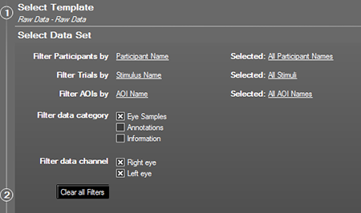
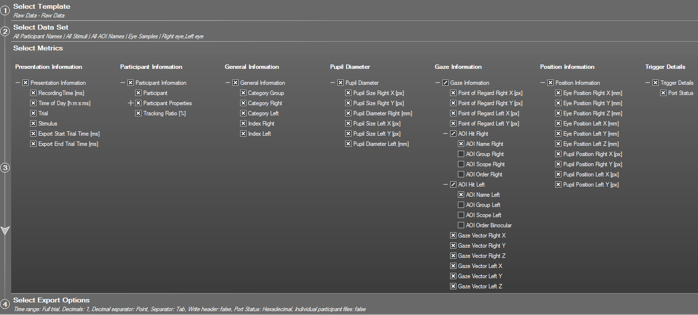
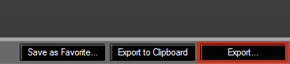
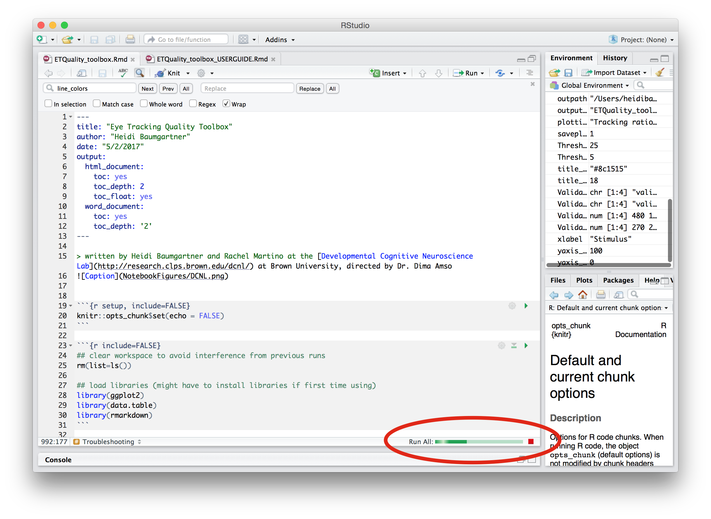

Eye Tracking Quality Toolbox USER GUIDE
================
Heidi Baumgartner
5/21/2017

-   [Overview](#overview)
    -   [Requirements](#requirements)
    -   [Input](#input)
    -   [Output](#output)
-   [Instructions](#instructions)
-   [Generate input](#generate-input)
    -   [Using SMI BeGaze](#using-smi-begaze)
    -   [Using a non-SMI system](#using-a-non-smi-system)
-   [Troubleshooting](#troubleshooting)
-   [Contact](#contact)

> written at the [Developmental Cognitive Neuroscience Lab](http://research.clps.brown.edu/dcnl/) at Brown University, directed by Dr. Dima Amso
> 

Overview
========

Some eye-tracking (ET) systems collect independent data streams from each eye (left and right), but analysis protocols often require the user to choose one eye or the other for analysis purposes. In optimal circumstances, it makes little difference which eye is used because these data streams are nearly identical. Sometimes, however, the data stream from one eye is significantly more stable or accurate than the stream from the other eye (*e.g.*, this situation occurs often when tracking very young participants with a between-eye distance that is at the lower limit of what the eye tracker can handle).

This toolbox is designed to quantify the **TRACKING RATIO** (percent of ET samples with non-zero gaze coordinates) and calibration **ACCURACY** (deviation of estimated point-of-regard from defined coordinates) by eye (R/L) for eye tracking data and to **RECOMMEND** which eye to use for subsequent analyses based on these metrics. The toolbox is designed to work with data generated by BeGaze (SensoMotoric Instruments), but should work as long as the variables/format specified in [Using a non-SMI system](#using-a-non-smi-system) are present.

Requirements
------------

-   RStudio with R packages ggplot2, data.table, and rmarkdown installed ([go here](https://rmarkdown.rstudio.com/authoring_quick_tour.html) for an overview of R Markdown and installation instructions)
-   Hz-level eye tracking data (see [Generate input](#generate-input) for details)

Input
-----

The **INPUT** for this toolbox is raw gaze data (1 row per Hz/sample; X,Y point-of-reference (POR) coordinates; AOI hit labels). Data can be in one or more tab-delimited .txt file(s) located in a data directory (path specified in the [Set parameters](#set-parameters) section of toolbox). Example data files can be found in the */ExampleData* subdirectory. See [Generate input](#generate-input) section for more information.

In addition to experimental stimuli, there must be at least one "validation" stimulus that can be used to compare participants' estimated POR to the physical screen location of a stimulus (i.e., the 'expected' POR). Custom validation stimuli that mimic the SMI calibration procedure can be found in the */Validation\_Stimuli* subdirectory for inclusion in any experiment. Other appropriate validation stimuli would be any relatively small stimulus presented in isolation (e.g., a central fixation cross). *If you do not have any appropriate validation stimuli in your experiment, run toolbox with default ValidationStim, ValidationAOI, ValidationX, and ValidationY definitions. The toolbox will not find any matches in the data and will get stuck when trying to calculate deviation values, but it should still compute Tracking Ratio values which can then be used for eye choice purposes.*

Output
------

The **OUTPUT** generated by the toolbox:

1.  An .html file with plots and summary data tables generated by the toolbox

2.  A .csv file (saved to data subdirectory) with summary metrics for each participant (tracking ratio, validation deviations, and distance from screen for each eye) along with a participant-level suggestion based on quality metrics for which eye to use (left or right) for subsequent analyses.

3.  Individual .png files for each plot (if *saveplotstofile=1*)

**Eye suggestion is based on the following decision parameters:**

-   If there are no differences in quantity/quality metrics by eye (*i.e.*, difference values are below thresholds for what constitute 'meaningful' differences), use the eye with the better tracking ratio (*i.e.*, more data)
-   If the same eye has both a better (*i.e.*, higher) tracking ratio and a better (*i.e.*, lower) average deviation from validation stimuli, use that eye
-   If one eye has a better validation deviation value and the tracking ratio difference is below threshold, use the eye with the better deviation value
-   If one eye has a better tracking ratio and there is no difference by eye in deviation values, use the eye with better tracking ratio
-   If one eye has a better tracking ratio but the other eye has a lower deviation value, this subject is flagged as *'undetermined'* for the user to decide based on experiment priorities (need to decide whether data quantity or precision is more important)
-   If toolbox is unable to generate accuracy metrics (*e.g.*, due to no valid fixations to validation stimuli), this subject is flagged as *'no accuracy stats'* for user to investigate

------------------------------------------------------------------------

Instructions
============

1.  **[Generate input](#generate-input)** for toolbox using SMI BeGaze (or other method).

2.  **Open the ET Quality Toolbox R Markdown file** (*ET\_Quality\_toolbox.Rmd*) in R Studio.

3.  **Update experiment-specific parameters** (data location, stimulus names, etc.) under 'Set parameters' header in R Markdown script

4.  **Run toolbox**: in RStudio toolbar, choose **'Run All'** from **'Run'** pull-down menu (*Option-Command-R*). If for any reason the toolbox does not run successfully, see the [Troubleshooting](#troubleshooting) section for help understanding errors.

5.  **Knit results to HTML document**: in RStudio toolbar, click the **'Knit'** button (next to 'Find/Replace' button). Examine plots and tables. If you want to adjust plot parameters, see \#6. Otherwise, skip \#6.

6.  **Edit parameters as needed**: if you want to change any parameters (including plot formatting), make changes and then re-run toolbox and re-knit until you are satisfied. Optimal formatting for plots is highly dependant on the number of subjects, stimuli, and trials in your experiment, so you might need to tinker with plot parameters.
    -   **To resize plots in R Markdown HTML document**: Find chunk of code for the plot and adjust values for *fig.width* and *fig.height* in first line of chunk.
    -   **To resize plots saved to .png files**: Adjust values for *ggsave(…, width= , height=)* toward end of chunk. After adjusting the parameters for a plot, you can re-generate that plot by running only that chunk. Once you are satisfied with all plot parameters, it is suggested you re-run the entire toolbox and Knit to HTML.

7.  **Export results to Word doc (Optional)**: Summary metrics (.csv file) and plots (.png files) will automatically be saved to a subdirectory within your data directory (.png file saving is optional), and the HTML document will automatically be saved in the same directory as the R Markdown file. If you want to also export the report to a Word document: In RStudio toolbar, choose **'Knit to Word'** from *'Knit'* pull-down menu (Word doc will save to same directory as R Markdown file)

**Note:** *Some code is visible in output to make parameters and computations transparent, but the rest of the code is hidden by default. To show code from any chunk in output, change {r} in first line of chunk to {r echo=TRUE}. To hide code that is visible, remove echo=TRUE from chunk options.*

------------------------------------------------------------------------

Generate input
==============

The toolbox was designed to work with data generated by SMI’s BeGaze analysis software, but should work as long as the data is in the proper format (1 row/Hz) and the variables specified in the [Using a non-SMI system](#using-a-non-smi-system) section are present. Example data files in tab-delimited .txt format can be found in the */ExampleData* subdirectory.

Using SMI BeGaze
----------------

#### BeGaze data prep:

-   If using DCNL custom validation block (mimics SMI validation procedure and presents stimuli in upper left, upper right, lower left, lower right quadrants of the screen), **import validation AOIs** from */Validation\_AOIs* toolbox subdirectory onto validation stimuli (found in */Validation\_Stimuli* directory).

-   If using other stimuli for validation purposes (*e.g.*, a central fixation cross), **draw an AOI** on each validation stimulus. AOI should be large enough to catch fixations to stimulus even if calibration is inaccurate, but constrained enough to exclude fixations to other regions of screen (*e.g.*, pre-saccade fixation at previous stimulus location). **Note the name and center X/Y coordinates of each AOI/stimulus**.

 

#### Export 'Raw Data' metrics from BeGaze (Metrics Export/Raw Data)

1.  ***Select Data Set:***
    -   **SELECT**: 'Eye Samples', 'Right Eye', 'Left Eye'.
    -   **DESELECT**: 'Annotations', 'Information'
    -   Make sure all stimuli that are relevant to experiment and calibration/validation are selected; it is not necessary to filter out other stimuli because you can specify which stimuli to use/ignore when defining parameters below
        
         

2.  ***Select Metrics:***
    -   **RECOMMENDED**: select all metrics except for 'AOI Group/Scope/Order'
    -   **REQUIRED**: all 'Presentation' and 'Participant Information' metrics, 'Index R/L', 'Point of Regard X/Y R/L', 'AOI Name R/L', 'Eye Position Z R/L'
        
         

3.  ***Select Export Options:***
    -   **Time range**: Full trial
    -   **Seperator**: Tab
    -   **DESELECT**: 'Write header', 'Individual participant files'
            

4.  ***Export...:***
    -   **Export**: save file as *'ExperimentName\_RawData.txt'*
        
         

Using a non-SMI system
----------------------

**The following variables are required for the toolbox to run**:

-   *'Participant':* subject number/identifier
-   *'RecordingTime \[ms\]':* time (in ms) of sample
-   *'Point of Regard Right X \[px\]':* gaze X, right eye
-   *'Point of Regard Right Y \[px\]':* gaze Y, right eye
-   *'Point of Regard Left X \[px\]':* gaze X, left eye
-   *'Point of Regard Left Y \[px\]':* gaze Y, left eye
-   *'AOI Name Right':* AOI hit, right eye
-   *'AOI Name Left':* AOI hit, left eye
-   *'Eye Position Right Z \[mm\]':* distance from screen, right eye
-   *'Eye Position Left Z \[mm\]':* distance from screen, left eye
-   *'Index Right':* index (*i.e.*, count) of current eye event (fixation, saccade, blink), right eye
-   *'Index Left':* index of current eye event, left eye

**NOTE:** If you not using BeGaze to export your data and the variables in your data file have different names, you can edit the variable names that the toolbox is expecting in the [Load and Organize Data](#load-and-organize-data) section, OR you can rename the variable names in your data file before running the toolbox)

------------------------------------------------------------------------

Troubleshooting
===============

R Markdown provides green progress bars to indicate overall progress (located in bottom of R Markdown window) and current processing (located on the left side of the R Markdown window). If the toolbox gets stuck at any point (*e.g.*, because of an undefined or missing variable), you can find the source of the error by locating where the left-side progress bar is red. Information regarding the error will be displayed below that 'chunk' of code (and in the R Console window) to help you diagnose the problem. 

**Some possible errors and how to fix them:**

> Error in setwd(datadir) : cannot change working directory

This means that you've set a data directory path (in 'Set parameters' section) that does not exist. Check that the path defined for *datadir* is correct and try re-running toolbox.
 

> Error in setnames(x, value) : x has no column names

This error indicates that the toolbox was unable to identify/load in any data (and therefore the data table is empty). Check that there is at least one data .txt file in the data directory and then try re-running.
 

> Error in rbindlist(lapply(files, fread)) :
> Item 3 has 42 columns, inconsistent with item 1 which has 43 columns. If instead you need to fill missing columns, use set argument 'fill' to TRUE.

This error will occur if you are trying to import more than one data file and the files do not all have the same number of columns. Make sure your data files are in the same format and re-run.
 

> Error: Faceting variables must have at least one value

This error is related to generating the plots that are faceted by subject. If you get this error in the section plotting tracking ratio values by subject, this means that no rows of gaze data in your data matched the stimulus names defined by *ExperimentalStim* (or *FillerStim*). If the error occurs in the section plotting deviation values by subject, this means that no rows of gaze data matched the stimulus names/AOIs defined by *ValidationStim* and *ValidationAOI*. Check these definitions and try again.  

------------------------------------------------------------------------

Contact
=======

Contact Heidi Baumgartner (<heidibaum@gmail.com>) with questions or with feature requests.
